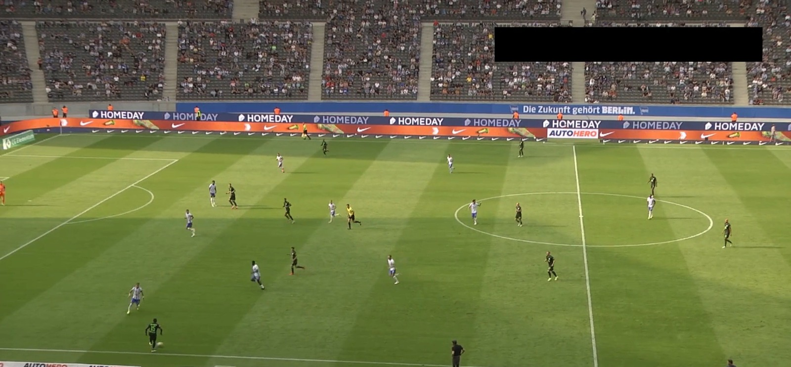
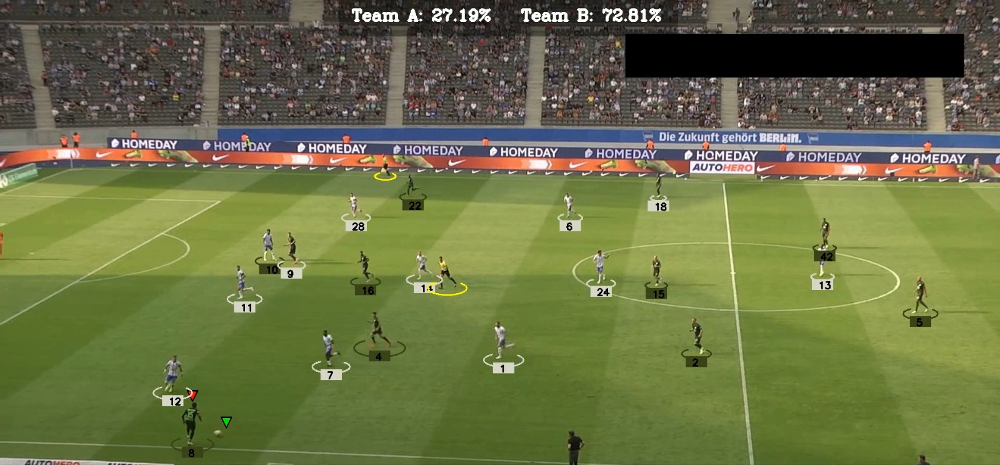
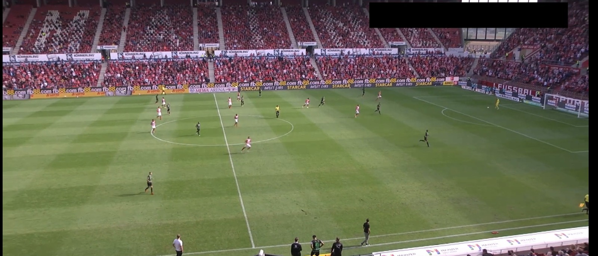
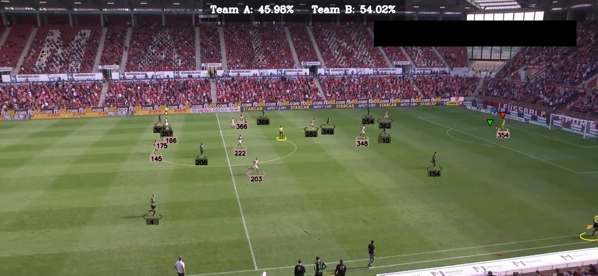

# ⚽ FootballAnalysisAI – Video-Based Football Match Analyzer  
*Python · OpenCV · YOLOv5x · Supervision · Flask*

FootballAnalysisAI is an intelligent football match analysis system that helps teams with post/pre-match strategy by detecting players, referees, and the ball in real time from match footage. It provides automated visual insights like team-wise ball possession and player-team assignment using computer vision and AI.

---

## 🧠 How It Works

### 📦 Step-by-Step Pipeline

1. **Object Detection using YOLOv5x**  
   The system uses a YOLOv5x model trained on the [Roboflow Football Dataset](https://universe.roboflow.com/roboflow-jvuqo/football-players-detection-3zvbc/dataset/1) to detect:
   - Players
   - Referees
   - Football

2. **Tracking Across Frames**  
   Detected objects are tracked across video frames using trackers to maintain consistent object IDs.

3. **Team Classification with KMeans**  
   Each player's jersey color is extracted using **pixel segmentation**, and **KMeans clustering** assigns players to teams based on dominant color regions.

4. **Ball Possession Estimation**  
   The system calculates **real-time ball possession percentages** by analyzing which team controls the ball over time.

5. **Ball Interpolation**  
   When the ball is not detected in a frame (due to occlusion or blur), **ball position is estimated** using interpolation techniques based on nearby frames.

---

## 📸 INPUT/OUTPUT Snapshots

  
  
  

[Click to watch demo](https://drive.google.com/file/d/193H_jXFgPL8QZiTcu-h5gUXUmRP8gq0o/view?usp=sharing)

---

## 🧩 Modules Used

| Module         | Purpose                                                             |
|----------------|---------------------------------------------------------------------|
| `YOLOv5x`      | Detect players, referees, and the ball                              |
| `KMeans`       | Classify players into teams based on t-shirt colors                 |
| `Supervision`  | Visual annotation, bounding box drawing, and tracking overlays      |
| `OpenCV`       | Video frame manipulation, interpolation, drawing, etc.              |
| `Flask`        | Web interface for uploading and visualizing match analysis          |

---

## 📂 Project Structure

